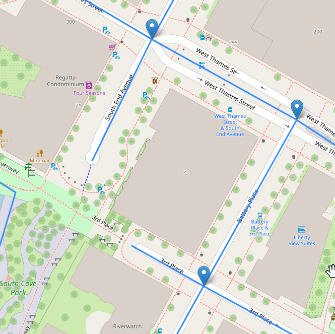

# Explorer-TDSP
A transportation data science project (TDSP) hosted by the Northeast Big Data Innovation Hub and National Student Data Corps, in collaboration with the U.S. Department of Transportation Federal Highway Administration. The primary data source used was [Motor Vehicle Collisions - Crashes from NYC OpenData](https://data.cityofnewyork.us/Public-Safety/Motor-Vehicle-Collisions-Crashes/h9gi-nx95/about_data).

**Research Question:** I focused on answering the question: What is the relationship (if any) between intersection geometry (perpendicular or skewed) and crash rates in Manhattan?

## Methods
- Street geometry data was obtained from [NYC Street Centerline (CSCL)](https://data.cityofnewyork.us/City-Government/NYC-Street-Centerline-CSCL-/exjm-f27b).
- Using Shapely and GeoPandas, street geometry was overlayed with itself to find intersections.
- Example of how intersecting street geometries create intersections.
- 
- Intersections were classified as perpendicular if the line geometry of two streets was 90 degrees or with 10 degrees of 90 degrees. Intersections were classified as skewed otherwise.
  - Note: when recreating this, the tolerance value for what is considered a perpendicular intersection can be changed to something other than 10 degrees if you would like. I used 10 degrees because that seems like common sense and ended up yielding interesting results.
- Crashes (within a max distance one CRS unit of an intersection) were assigned to that intersection.
  - Note: the max distance when assigning crashes to intersections can be modified. I used a distance of 1 and plenty of crashes were joined to their nearest intersection.
- The number of crashes the happened at each intersection type were aggregated. To mititgate the impact of intersection frequency (if more crashes happened at perpendicular intersections just because there are more perpendicular intersections for example), crash counts for each type of intersection were divided by the number of the respective interscetion type in the borough of Manhattan.

## Results
Perpendicular intersections had a higher crash rate per intersection than skewed intersections. This relationship was true at every level chosen for this analysis.
- Overall: any type of crash
- Fatal: a crash with at least one fatality
- Injurious: a crash with at least one injury, and no fatalities
- Non-injurious: a crash with no fatalities or injuries

## Discussion
In Manhattan, perpendicular intersections were observed to have a higher crash rate per intersection than skewed intersections. To improve safety by reducing the number of crashes that occur, more traffic calming methods such as raised crosswalks could be implemented. Interestingly, this analysis found that perpendicular intersections had a higher crash rate than skewed, which could be interpreted as perpendicular intersections being more dangerous than skewed. This differs from [2021 Federal Highway Administration findings](https://www.fhwa.dot.gov/publications/research/safety/20067/20067.pdf) that show skewed intersections are more dangerous than perpendicular ones. One possible reason for this difference is that the FHWA observed multiple locations, while this analysis focused on Manhattan only. More analysis would benefit this area of research and benefit the saftey of everyone who uses our roads for travel, work, leisure, and living their best lives.